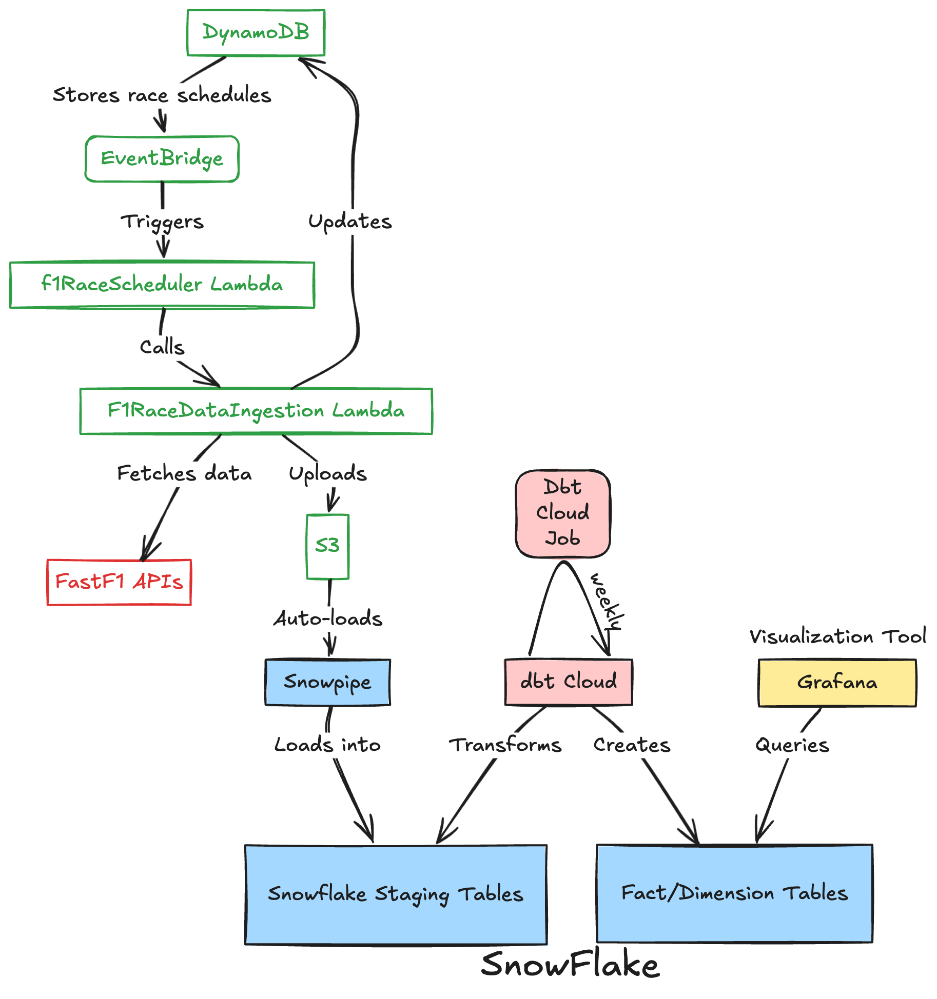

# Grand Prix Insights

This project automates the ingestion, transformation, and visualization of **Formula 1** race data. It combines **AWS** (Lambda, S3, DynamoDB, EventBridge, CloudWatch), **Snowflake** (staging + Snowpipe + dbt transformations), and **Grafana** to deliver both **historical** and **near real-time** insights into driver performances, race outcomes, and more.

---

## Table of Contents
1. [High-Level Overview](#high-level-overview)  
2. [Architecture Diagram](#architecture-diagram)  
3. [Components & Data Flow](#components--data-flow)  
    - [1. AWS DynamoDB & EventBridge](#1-aws-dynamodb--eventbridge)  
    - [2. AWS Lambda Functions](#2-aws-lambda-functions)  
    - [3. Amazon S3 Bucket](#3-amazon-s3-bucket)  
    - [4. Snowpipe into Snowflake Staging](#4-snowpipe-into-snowflake-staging)  
    - [5. dbt Cloud Transformations](#5-dbt-cloud-transformations)  
    - [6. Fact/Dimension Tables](#6-factdimension-tables)  
    - [7. Visualization with Grafana](#7-visualization-with-grafana)  
4. [Historical vs Real-Time Data Handling](#historical-vs-real-time-data-handling)  
5. [AWS Scheduling & Automation Details](#aws-scheduling--automation-details)  
6. [Data Model Highlights](#data-model-highlights)  
7. [Setup & Usage](#setup--usage)  
8. [Potential Extensions](#potential-extensions)  

---

## High-Level Overview

- **Goal**: Provide an end-to-end platform where **F1 race data** flows from external APIs (in this case FastF1) through AWS (Lambda, S3, DynamoDB) into **Snowflake** for staging and transformations by **dbt**, culminating in **Grafana** dashboards for visual analytics.  
- **Key Features**:
  - **Automated ingestion** of upcoming race schedules and data via Lambda + EventBridge.  
  - **Incremental** data loads into Snowflake (through Snowpipe, then dbt).  
  - **Star schema** design with fact and dimension tables for easy BI queries.  
  - **Scheduled transformations** (dbt Cloud weekly runs) plus near real-time or frequent ingestion for upcoming races.

---

## Architecture Diagram



**Diagram Explanation**:
1. **DynamoDB** holds upcoming race schedules (dates, times, event info).  
2. **EventBridge** triggers a Lambda scheduler (`f1RaceScheduler`) based on next-race timings stored in DynamoDB.  
3. **f1RaceScheduler** calls **F1RaceDataIngestion** Lambda at the right time.  
4. **F1RaceDataIngestion** fetches race data from FastF1 APIs, pre-processes it, and **uploads** to S3. Then updates DynamoDB for the next event.  
5. **Snowpipe** auto-loads new data from S3 into Snowflake **staging tables**.  
6. **dbt Cloud** transforms staging data into **fact/dimension** tables.  
7. **Grafana** queries final tables for dashboards.

---

## Components & Data Flow

### 1. AWS DynamoDB & EventBridge
- **DynamoDB**  
  - Contains upcoming race events, e.g., `{ "raceId": "Monza2025", "raceDate": "2025-09-05T14:00:00Z", ... }`.  
- **EventBridge**  
  - Uses a rule to schedule or trigger **f1RaceScheduler** based on the next race date/time in DynamoDB.

### 2. AWS Lambda Functions

1. **f1RaceScheduler**  
   - Reads the next scheduled race from DynamoDB.  
   - Uses **CloudWatch** or **EventBridge** to trigger the `F1RaceDataIngestion` Lambda at the correct time.  
   - Updates the table for the subsequent race event.

2. **F1RaceDataIngestion**  
   - Invoked near race time by `f1RaceScheduler`.  
   - Calls **FastF1** APIs, fetches relevant data (laps, drivers, weather, etc.).  
   - Preprocesses or cleans the data.  
   - Uploads files to **S3**.  
   - (Optional) Logs or updates DynamoDB that ingestion is complete.

### 3. Amazon S3 Bucket
- Acts as a **landing zone** for new data.  
- The raw JSON/CSV is stored in a structured path, e.g., `s3://my-f1-datalake/2025/monza/laps.json`.  
- **Snowpipe** watches this bucket and loads new files into Snowflake almost immediately.

### 4. Snowpipe into Snowflake Staging
- **Snowpipe** is configured with a file ingestion pipeline.  
- When new objects appear in the S3 bucket, Snowpipe copies them to **Snowflake staging** tables such as:  
  - `LAPS_STAGING`  
  - `DRIVERS_INFO_STAGING`  
  - `WEATHER_STAGING`  
- Each table has columns like `load_time` or ingestion metadata.

### 5. dbt Cloud Transformations
- **dbt** runs on a **weekly** schedule (or more often).  
- **Incremental Models**:
  - `stg_laps`, `stg_drivers_info`, `stg_weather` combine/clean data from staging.  
  - **Fact/Dimension** models (e.g., `fact_laps`, `dim_drivers`) transform and join relevant columns.  
- **Merge or Insert** logic ensures only new data is processed each run.  
- Final tables are in a separate Snowflake schema, e.g. `F1_DASHBOARD.FACTS` and `F1_DASHBOARD.DIMS`.

### 6. Fact/Dimension Tables
- **dim_drivers**: Driver name, nationality, driver ID, etc.  
- **dim_sessions** or **dim_circuits**: Race or circuit-level attributes (circuit name, location, race year).  
- **fact_laps**: Lap times, sector speeds, position changes.  
- **fact_race_results**: Final classifications, points gained, grid positions.  
- **fact_weather**: Temperature, humidity, rainfall by time.

### 7. Visualization with Grafana
- **Grafana** is connected to Snowflake
- Dashboards can show:
  - **Race Progress**: Plot drivers’ positions by lap.  
  - **Points & Standings**: Summaries of driver/team points.  
  - **Weather Effects**: Comparing track temp or rain to lap times.

---

[//]: # (## Historical vs Real-Time Data Handling)

[//]: # ()
[//]: # (1. **Historical**  )

[//]: # (   - Backfill past races by manually pushing their data to S3 &#40;or reusing the ingestion Lambda for older events&#41;.  )

[//]: # (   - Snowpipe + dbt transformations load them, building a multi-year dataset for analytics.)

[//]: # ()
[//]: # (2. **Near Real-Time**  )

[//]: # (   - As a race weekend occurs, the scheduler triggers data ingestion.  )

[//]: # (   - Data is continuously or periodically uploaded to S3.  )

[//]: # (   - Snowflake + dbt can refresh, and Grafana dashboards display new results soon after.)

---

## AWS Scheduling & Automation Details

- **DynamoDB** keeps a list of upcoming races with timestamps.  
- **EventBridge** or **CloudWatch** triggers **f1RaceScheduler**.  
- **f1RaceScheduler** sets or updates the trigger for **F1RaceDataIngestion**.  
- **F1RaceDataIngestion** fetches from external APIs, dumps to S3.  
- Snowpipe detects new S3 files → loads to Snowflake.  
- dbt Cloud runs a scheduled job to update star schema.  
- Grafana refreshes visuals at your chosen interval.

This fully automates the data pipeline: from race schedule lookups to final analytics.

---

## Data Model Highlights

- **Incremental** dbt models:
  - Use `materialized='incremental'` and `unique_key` to merge new rows.  
  - Example:
    ```jinja
    {{ config(
        materialized='incremental',
        unique_key=['circuit_name','driver_number','race_year','session_type'],
        incremental_strategy='merge'
    ) }}
    ```
- **Star Schema**:
  - **Dimensions** for stable attributes (drivers, circuits, teams).  
  - **Facts** for numeric or event-based metrics (laps, weather logs, race results).
- **SCD Type 2** (optional) if you want to track historical changes (e.g., driver switching teams) and keep an audit of old vs. new data.

---

## Setup & Usage

1. **Clone the Repository**  
   - Contains Lambda code, dbt SQL models, and example scripts.

2. **AWS Configuration**  
   - Deploy the **f1RaceScheduler** and **F1RaceDataIngestion** Lambda functions (using SAM, Serverless Framework, or manual setup).  
   - Create a **DynamoDB** table for race schedules.  
   - Set up **EventBridge** rules or CloudWatch schedules to trigger the Lambdas.

3. **Snowflake Setup**  
   - Create staging tables (e.g., `LAPS_STAGING`).  
   - Configure **Snowpipe** with file formats and a pipe for each staging table.  
   - Verify that new S3 files are loading automatically.

4. **dbt Cloud**  
   - Connect your Snowflake account in dbt Cloud.  
   - Set a weekly or daily schedule to run `dbt run`.  
   - Check logs to confirm incremental loads are working.

5. **Grafana**  
   - Create a data source for Snowflake.  
   - Build dashboards for race analysis, driver performance, weather correlations, etc.  
   - Set auto-refresh intervals (e.g. every 5 minutes).

---

## Potential Extensions

- **Advanced ML**: Predict pit stop laps, tire strategies, or finishing positions.  
- **Deeper SCD**: Track dimension changes over time with Type 2 approach.  
- **Automated Alerts**: If a driver’s pace changes abruptly, send Slack/Teams notifications from Grafana.  
- **Multi-Cloud**: Extend to other data lakes or incorporate GCP/Azure services.

---

[//]: # ()
[//]: # (## Contact & Credits)

[//]: # ()
[//]: # (- **Author/Maintainer**: [Your Name]&#40;https://github.com/yourprofile&#41;  )

[//]: # (- **Data Source**: [FastF1]&#40;https://github.com/theOehrly/Fast-F1&#41; / [OpenF1]&#40;https://pypi.org/project/openf1/&#41;  )

[//]: # (- **License**: MIT / Apache 2.0 &#40;choose one&#41;  )

[//]: # (- **Questions or Contributions**:  )

[//]: # (  - Open an issue on GitHub or ping me on [LinkedIn]&#40;https://www.linkedin.com/&#41;.  )

[//]: # ()
[//]: # (**Thanks for exploring this project!** Feel free to submit Pull Requests or suggest improvements. Enjoy data-driven insights into F1 racing!)
